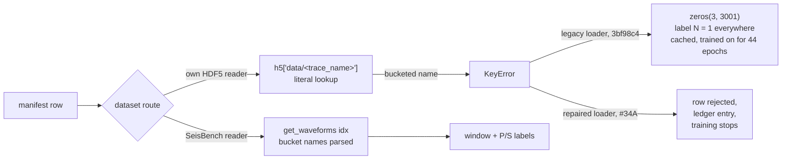

# When a failed read becomes a training example: the silent zero-window defect in the v7 fine-tune

*2026-09-11, Marine Denolle with Claude. Written for the group. Every code
claim cites a file and line in this repository; the two numbers this report
cannot give are marked as such and the steps that produce them are listed.*

## Summary

The loader that fed waveforms to the v7 fine-tune (and to every version
from v5 to v13) caught every error raised while reading a waveform from
disk and, instead of stopping, returned a window of zeros with a label
saying "noise everywhere." Its own HDF5 readers could not read the
bucket-indexed trace names that SeisBench uses for large datasets, so for
any dataset stored that way and read through those readers, every row
became such a zero window. The failure was silent by design and stayed
silent because the counter that would have reported it was added on
2026-07-12, a month after v7 was evaluated. The code path is fixed in the
loader merged on 2026-09-11 (#34A, PR #62), which reads bucket names and
refuses to train on a row it cannot read. How many of v7's 527,477 training
rows took the zero path is not yet known; the replay that counts them is
PR #63 (checkpoint 34B), and a cheaper first answer is in the logs of the
runs trained after the counter was added.

## 1. How a training example is built

Training does not read waveforms from a dataset object. It reads a
manifest, `data/manifests_v2/train.csv`, one row per example, carrying
`dataset_name`, `trace_name`, `chunk`, `p_arrival_sample`,
`s_arrival_sample`. For each row `ManifestDataset.__getitem__` fetches the
waveform by `trace_name`, resamples it, cuts a 3,001-sample window with
the P pick placed 30 % of the way in (900 samples of pre-arrival context,
2,100 after; `_window` at `3bf98c4` line 224), and builds a label array
with three channels, P, S and N (noise), from Gaussians at the pick
samples. The v7 recipe preloads every
row once into RAM (`scripts/fast_manifest_dataset.py`,
`CachedManifestDataset`) and serves those cached windows for all 44 epochs.

SeisBench stores large datasets *bucketed*: hundreds of traces packed into
one HDF5 array, and the trace name encodes the address. A real name from
this repository's benchmark manifest:

```
bucket721$545,:3,:12000
```

means "array `bucket721`, row 545, all three channels, the first 12,000
samples." SeisBench's own reader parses this. A reader that looks up
`data/bucket721$545,:3,:12000` as a literal key finds nothing.

## 2. The defect, in the code v7 used

The loader is `scripts/manifest_dataset.py` at commit `3bf98c4`, the commit
that introduced the v5 to v13 files. Two pieces combine.

**The direct readers look names up literally** (`3bf98c4`, lines 57–64 and
84–90):

```python
def get_waveform(self, trace_name):
    key = f"data/{trace_name}"
    if key not in self._h5:
        raise KeyError(f"Trace '{trace_name}' not found in HDF5")
    return self._h5[key][()]
```

**The fetch is wrapped in a catch-all that returns a fake sample**
(`3bf98c4`, `__getitem__` at line 345, the handler at lines 370–375):

```python
try:
    ...fetch the waveform...
except Exception as exc:
    # Return a zero sample rather than crashing a training batch
    wf_zero  = torch.zeros(3, self.window_len)
    lbl_zero = torch.zeros(3, self.window_len)
    lbl_zero[2] = 1.0        # N channel: "noise" at every sample
    return wf_zero, lbl_zero
```

Which datasets went through which reader is fixed by the loader's registry
(`3bf98c4`, `_CHUNKED_DS`, `_SINGLE_HDF5_DS`, `_SBD_CLASSES`):

| Read through | Datasets | Bucket names parsed? | Sum of caps (`build_training_dataset.py` lines 222–335) |
|---|---|---|--:|
| SeisBench's reader | stead, instancecounts, geofon, ethz, ceed, crew, txed, pnw, lendb, vcseis, iquique, obst2024, scedc | yes | 823,400 |
| Own single-file reader | meier2019jgr, ross2018gpd, pisdl | **no** | 360,000 |
| Own chunked reader | mlaapde, cwa, aq2009gm | **no** | 170,000 |

So the question "how much of v7's corpus was zeros" reduces to "which of
the six direct-read datasets are stored bucketed on the lab server." Their
caps sum to 530,000 against 823,400 for the SeisBench route, before
stratification and the split; the training manifest itself has 527,477
rows (`docs/2026-09-07_training_history_audit.md` line 96). The answer therefore ranges from
almost nothing to most of the corpus, and nothing in this clone can narrow
it: the HDF5 files and the manifest live only on the server.



## 3. What a zero window teaches

The zero window survives normalisation: `_normalise_std` replaces a
standard deviation below 10⁻⁶ by one, so zeros stay zeros (`3bf98c4`, lines
190–194). The model then receives an all-zero input with a target that says
"no phase anywhere" and gets a gradient for it in every epoch. Three things
follow.

- The P and S picks of those rows never reached the model. The corpus the
  model saw was not the corpus the manifest describes, the composition
  targets (25 % teleseismic, 40 % local, and so on) were not what was
  trained, and every statement in the training-history audit that reasons
  from manifest composition inherits that uncertainty.
- Batches containing all-zero inputs pull the batch-normalisation running
  statistics toward zero variance. The v7 checkpoint's input-layer running
  variance is 0.758 of the parent's, median over channels
  (`docs/2026-09-10_picker_and_issue_roadmap_audit.md`, "Batch
  normalization deserves a cheap ablation", from
  `docs/audit_2026-09-10/probes.py`). That is the direction zero batches
  push it; it is consistent with the defect, not proof of it.
- The loss was computed on fewer real examples than the epoch count
  suggests, so learning-rate and early-stopping decisions were made on a
  smaller effective dataset than anyone believed.

What it does not do is teach a wrong pick: a zero input labelled noise is
consistent. The harm is absence and dilution, not contradiction.

## 4. Why it was not seen

| Date | Event |
|---|---|
| 2026-06-15 | v7 evaluated on the benchmark (`e555757`) and later chosen for deployment |
| 2026-06-26 | review issue #14 opened, listing among "lower impact" hygiene items that "waveform-fetch exceptions are swallowed and returned as all-noise zero samples — at minimum log/count them" |
| 2026-07-12 | fix #14 (`71d7e2d`) adds a counter and a log line for fetch failures; the substitution itself is kept |
| 2026-09-10 | independent audit finds the native-rate label misalignment; the same loader read confirms the zero path |
| 2026-09-11 | #34A merged: bucket parsing, rate resolution, rejection instead of substitution; PR #63 proposes the historical replay |

Two habits let it through. The loader was written to keep a batch alive
rather than to stop, so a systematic failure looked like nothing at all.
And the benchmark scores positives only, reading the model's probability
at the true pick inside a ±5 s window, so a model trained on a diminished
corpus still produced plausible numbers and there was no per-dataset
"rows actually read" count anywhere in the training record.

## 5. What is known and what is not

Known, from the code: the path existed, was silent, and fired on every
bucketed name read through the direct readers. Known, from the tests in
PR #63 against the pinned historical definitions: a bucketed name on the
direct route produces exactly the zero window described above.

Not known: whether `meier2019jgr`, `ross2018gpd`, `pisdl`, `mlaapde`, `cwa`
and `aq2009gm` are stored bucketed on the server, and therefore the number of
affected rows per dataset and split.

## 6. How the number is obtained

**Cheap, first.** Every run trained after 2026-07-12 on the same manifest
family logged its fetch-failure count (v18's rerun of 07-21, v19, v20, and
the `_clean` variants, `results/finetune_*_metrics.csv` and the run logs on
the server). Those counts, per dataset, are the first estimate and take
minutes to read.

**Exact.** PR #63 (`scripts/audit_v7_rows.py`, checkpoint 34B) replays the
pinned `3bf98c4` loader and the repaired loader on every manifest row and
writes, per row, the legacy status (`ok`, `zero_noise_substitution`,
`initialization_error`) and the corrected status, plus the rate, identity
and label-time comparisons for the other defects. The run order on the
server:

```bash
python scripts/audit_v7_rows.py --manifest-dir <original manifests_v2> --cache-root <cache> --inventory-only --output <dir1>
python scripts/audit_v7_rows.py ... --max-rows 100 --output <dir2>     # diagnostic prefix, start with the six direct-read datasets
python scripts/audit_v7_rows.py ... --output <dir3>                    # full replay; phase_summary.csv holds the per-dataset counts
```

`legacy_zero_noise_rows` in `phase_summary.csv` is the number this report
is missing.

## 7. The fix

Merged in #34A (PR #62, `e400e16`; contract in
`docs/2026-09-10_34a_loader_contract.md`):

- `waveform_contract.read_hdf5_trace` parses bucket-indexed names without
  `eval`, so the direct readers now read what SeisBench's reader reads.
- The stored sampling rate is resolved from per-trace metadata or HDF5
  attributes and the pick index is transformed with the waveform, which
  closes the separate misalignment defect of the SeisBench routes.
- A row that cannot be read or has no usable arrival is **rejected**: an
  entry goes to a per-process ledger (`train.rejected.<pid>.jsonl`) and an
  exception is raised. `CachedManifestDataset` propagates it, so an
  incomplete cache cannot be used for training. The failure budget is zero.
- Resampling uses a polyphase FIR with a measured passband instead of the
  FFT resampler.

Still open: the historical count (34B, PR #63); parity between this loader
and the deployed SeisBench/QuakeScope preprocessing (34C); and the decision
on whether to retrain, which depends on the count. If most of the five
direct-read datasets were zeros, v7's result says little about what this
recipe can do, and the data-scaling question (#45) reopens with the
corrected loader.

## 8. What to take from this

- A data loader must fail loudly. Fabricating a sample to keep a batch
  alive converts a bug into training data, and the model will not tell you.
- Test the loader with synthetic fixtures at every sampling rate and every
  storage format you expect, including the exotic name syntax of your
  dependencies; PR #62's tests do this in a few hundred lines and would
  have caught both defects in June.
- Count what was actually read, per dataset, and write it next to the
  checkpoint. A manifest describes an intention; the ledger describes what
  happened.
- A benchmark that scores only positives cannot see a diminished corpus.
  The false-alarm side and the continuous-data test found this model out;
  the positives-only leaderboard did not.
- Keep the code that produced a model pinned by commit and the inputs
  pinned by hash, or a defect like this cannot be replayed a year later.
  That is what made the replay in PR #63 possible at all.

## Related defects in the same loader

- Native-rate pick indices left in source coordinates while the waveform
  was resampled (SeisBench routes; 2026-09-10 audit finding 1; fixed in #34A).
- Absent S labels and unlabelled second events trained as confident noise
  (finding 4; a label-validity policy is #41).
- The deployment resampler's 6 dB loss at half the source Nyquist for
  non-integer ratios (comment on #34 of 2026-09-10; 34C).
